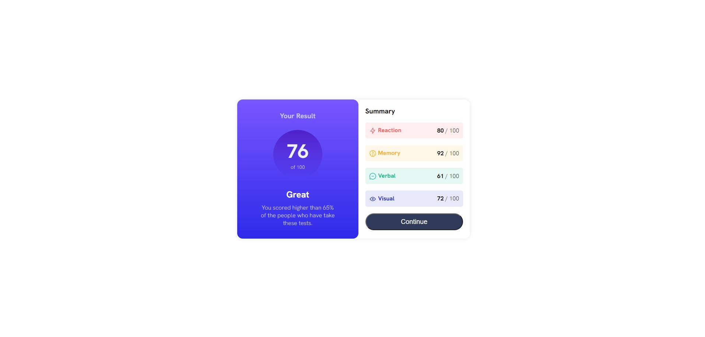
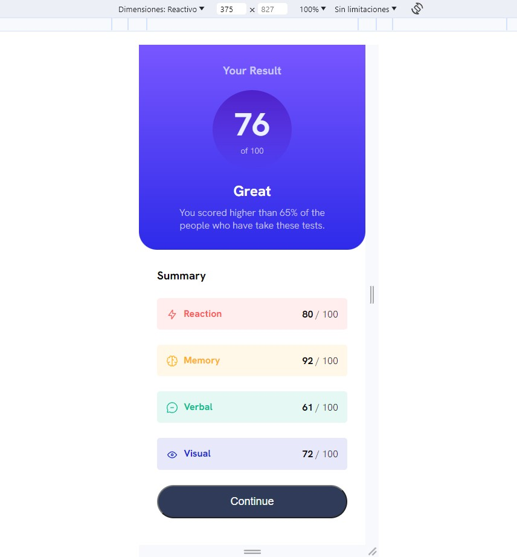

# Frontend Mentor - Results summary component

This is a solution to the Results summary component challenge on Frontend Mentor](https://www.frontendmentor.io/challenges/results-summary-component-CE_K6s0maV). Frontend Mentor challenges help you improve your coding skills by building realistic projects. 

### Links

- Live Site URL: [https://frontend-mentor-qr-code-component-chi.vercel.app/](https://frontend-mentor-qr-code-component-chi.vercel.app/)

### Built with

- Semantic HTML5 markup
- CSS custom properties
- Mobile-first workflow

